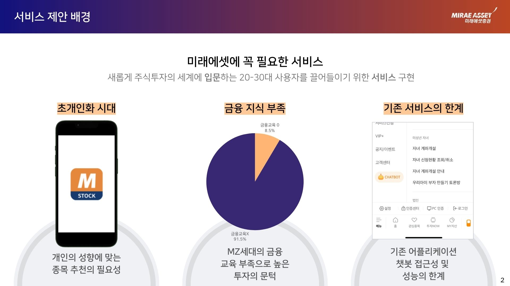
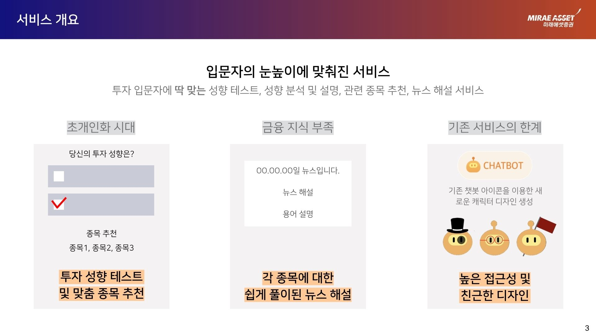
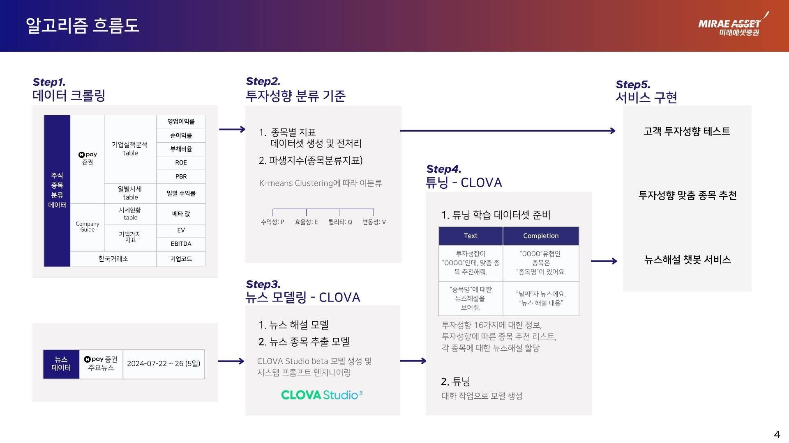
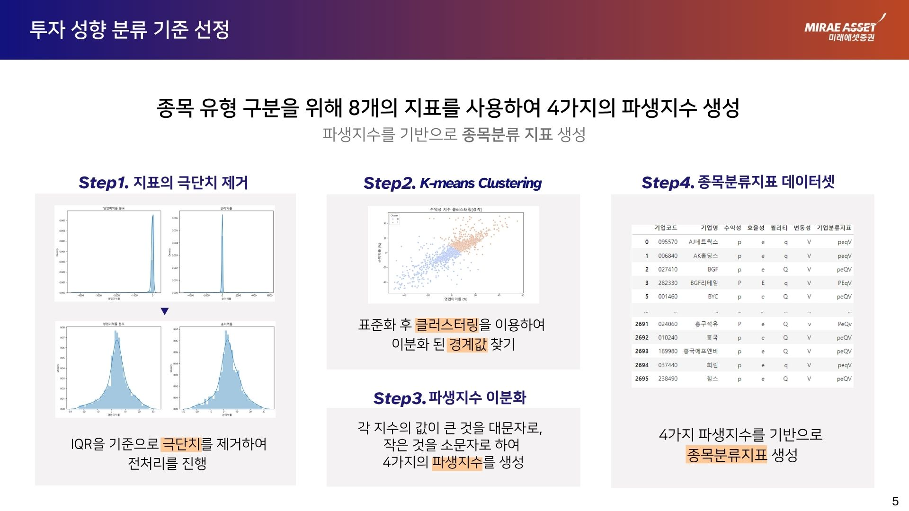

# 주식투자 입문자를 위한 맞춤형 뉴스 해설 서비스

> **2024 미래에셋증권 X Naver Cloud 빅데이터 페스타**  
> Team 럭키통계쟈나 (양윤규 · 장윤서 · 현민영) · 2024.07.31

---

## 왜 이 서비스인가?



MZ세대의 **91.5%가 금융 교육을 받지 못한 채** 주식시장에 진입합니다.  
기존 증권사 앱의 챗봇은 단순 FAQ 수준에 머물러, 개인 성향에 맞는 종목 추천이나 뉴스 해설 기능이 전무합니다.

이 프로젝트는 세 가지 문제를 해결합니다:

- **초개인화 부재** — 투자 성향과 무관하게 동일한 정보를 제공
- **금융 지식 장벽** — 뉴스와 지표를 스스로 해석하기 어려운 입문자
- **기존 서비스 한계** — 챗봇의 낮은 접근성과 획일화된 응답

---

## 서비스 개요



투자 성향 테스트 → 맞춤 종목 추천 → HyperCLOVA X 기반 뉴스 해설까지,  
입문자가 스스로 투자 판단을 내릴 수 있도록 돕는 end-to-end 서비스입니다.

---

## 알고리즘 흐름도



---

## 투자 성향 분류 방법론



8개 종목 지표(ROE · PBR · EV/EBITDA · 베타 등)에서 **4가지 파생지수(수익성 P · 효율성 E · 퀄리티 Q · 변동성 V)** 를 생성하고,  
IQR 기반 극단치 제거 후 KMeans Clustering으로 종목을 분류합니다.

---

## 분석 파이프라인

```
Step 1. 데이터 크롤링
  └── 네이버페이 증권 재무제표 · 일별시세 · 기업가치 지표 · 한국거래소 기업코드

Step 2. 투자 성향 분류 기준 선정
  └── 8개 지표 → 4가지 파생지수(수익성 P · 효율성 E · 퀄리티 Q · 변동성 V)
  └── IQR 기반 극단치 제거 → KMeans Clustering → 종목분류지표 데이터셋 생성

Step 3. 뉴스 모델링 (HyperCLOVA)
  └── 뉴스 해설 모델 · 뉴스 종목 추출 모델
  └── CLOVA Studio 베타 모델 생성 및 시스템 프롬프트 엔지니어링

Step 4. 파인튜닝 (CLOVA)
  └── 투자 성향 16가지 정보 · 맞춤 종목 추천 리스트 · 종목별 뉴스해설 할당

Step 5. 서비스 구현
  └── 고객 투자 성향 테스트 → 맞춤 종목 추천 → 뉴스 해설 챗봇 서비스
```

---

## 노트북 구성

| 파일 | 내용 |
|------|------|
| `뉴스기사크롤링.ipynb` | 네이버 금융 뉴스 크롤링 (Selenium) |
| `뉴스전처리.ipynb` | 뉴스 텍스트 정제 및 전처리 |
| `뉴스종목추출.ipynb` | 뉴스에서 종목명 추출 |
| `뉴스해설추출.ipynb` | HyperCLOVA X 기반 뉴스 해설 생성 |
| `베타크롤링.ipynb` | 종목별 베타계수 크롤링 |
| `일별수익률표준편차계산.ipynb` | 수익률 변동성 계산 |
| `종목분류지표_클러스터링.ipynb` | KMeans 기반 종목 클러스터링 |
| `종목별_투자성향_뉴스해설.ipynb` | 투자 성향별 종목 뉴스 해설 통합 |

---

## 기술 스택

- **크롤링**: Selenium, BeautifulSoup
- **분석**: Python, pandas, numpy, scikit-learn
- **AI**: HyperCLOVA X (CLOVA Studio Fine-tuning)
- **클러스터링**: KMeans

---

## 데이터

크롤링 및 수집된 데이터는 `data/` 폴더에 위치합니다. (저작권 이슈로 원본 데이터 미포함)
